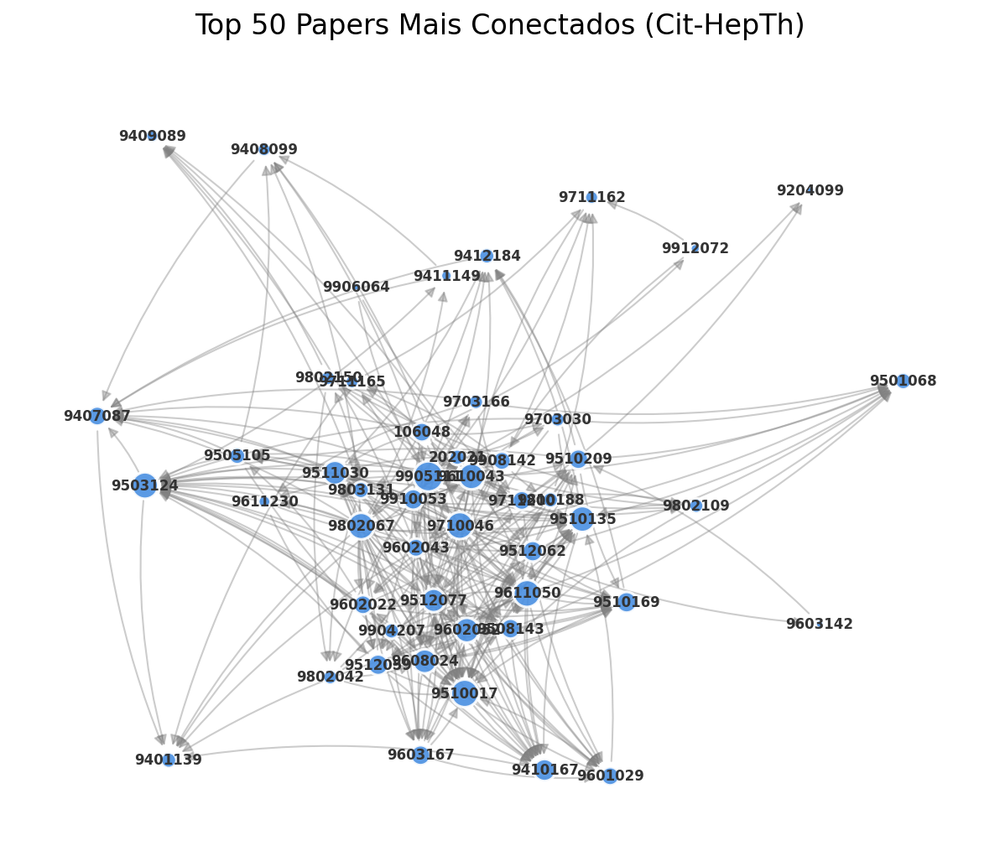

# Entrega Individual 

1. [Alexandre Martinelli](https://github.com/alexandremartinelli11){:target='_blank'}

## Introdução
O objetivo deste exercício é implementar e analisar o algoritmo PageRank aplicado a um grafo dirigido de citações acadêmicas. O PageRank, originalmente desenvolvido para ranquear páginas web, é aqui utilizado para identificar os artigos (papers) mais influentes dentro da comunidade de Física de Alta Energia.

## Descrição do Dataset
Para este estudo, foi selecionado o dataset **cit-HepTh** (High Energy Physics - Theory), disponibilizado pelo repositório SNAP (Stanford Network Analysis Platform).

* **Dominio:** Física de Alta Energia (Teoria).
* **Tipo de Grafo:** Dirigido (Directed).
* **Nós:** Representam artigos científicos (papers) submetidos ao arXiv.
* **Arestas:** Representam citações. Uma aresta $u \to v$ indica que o artigo $u$ cita o artigo $v$.
* **Período:** Abrange papers de Jan/1993 a Abr/2003.

**Estatísticas da Base:**
* **Total de Nós:** 27.770
* **Total de Arestas:** 352.807
* **Interpretação:** Neste contexto, um "alto PageRank" indica um paper fundamental ou seminal, que recebeu citações de outros papers também importantes.

## Metodologia
A implementação foi realizada em duas etapas:
1.  **Implementação Manual:** O algoritmo foi desenvolvido do zero utilizando a fórmula iterativa do método da potência, com fator de amortecimento $d=0.85$ e critério de convergência $\epsilon < 10^{-4}$.
2.  **Validação:** Os resultados foram comparados com a implementação da biblioteca `NetworkX`.

## Visualização da Rede

A imagem abaixo apresenta um subgrafo contendo os 50 artigos (nós) com maior número de conexões (citações feitas + recebidas). O tamanho dos nós é proporcional ao seu grau.

{ loading=lazy align=center }

> **Figura 1:** Visualização gerada via NetworkX destacando os hubs centrais da rede Cit-HepTh.

## Resultados e Discussão

Nesta seção, apresentamos os resultados obtidos pela implementação manual do algoritmo PageRank e os comparamos com a implementação de referência da biblioteca `NetworkX`. A análise foi realizada sobre o dataset **Cit-HepTh** (Citações de Física de Alta Energia).

### Cenário Padrão (d = 0.85)

O fator de amortecimento d = 0.85 é o padrão da indústria e modela o comportamento de um **"caminhante aleatório"** (random walker). Isso significa que existe 85% de probabilidade de o caminhante seguir um link de citação existente e 15% de probabilidade de ele reiniciar o processo em um artigo aleatório da base.

=== "Result d(0.85)"

    ```python exec="1" html="1"
    --8<-- "docs/pagerank/pagerank.py"
    ```
=== "Result d(0.5)"

    ```python exec="1" html="1"
    --8<-- "docs/pagerank/pagerank05.py"
    ```
=== "Result d(0.99)"

    ```python exec="1" html="1"
    --8<-- "docs/pagerank/pagerank09.py"
    ```

**Análise dos Líderes:**
O algoritmo identificou corretamente os trabalhos seminais da área. O paper **#1 (ID 9711200)** refere-se ao artigo *"The Large N Limit of Superconformal Field Theories and Supergravity"* de **Juan Maldacena**. Este é historicamente o trabalho mais citado em Física de Altas Energias, estabelecendo a correspondência AdS/CFT. O PageRank confirma sua importância estrutural na rede, superando outros artigos que, embora tenham muitas citações, não possuem a mesma centralidade de influência.

**Validação da Implementação:**
A implementação manual convergiu em **26 iterações**. Observa-se que ambos os algoritmos identificaram o mesmo grupo de "elite" (Top 10). As divergências numéricas na coluna "Diferença" ocorrem devido às diferentes estratégias de tratamento matemático dos *dangling nodes* (nós sem saída): enquanto o `NetworkX` redistribui essa massa via otimização matricial, a implementação manual realiza uma redistribuição iterativa.

---

### Análise de Sensibilidade: Variação do Fator d

Para compreender o impacto do fator de amortecimento na importância dos nós, variamos o parâmetro para um valor baixo (0.5) e um extremo (0.99).

**Tabela: Comparativo dos Top Papers sob diferentes fatores d**

| Paper ID | PR (d=0.5) | PR (d=0.85) | PR (d=0.99) | Tendência |
| :--- | :---: | :---: | :---: | :--- |
| **9711200** | 0.002367 | 0.003999 | 0.004652 | ⬆ Crescente |
| **9407087** | 0.001944 | 0.003280 | 0.003814 | ⬆ Crescente |
| **9802150** | 0.001644 | 0.002769 | 0.003219 | ⬆ Crescente |

**Discussão dos Cenários:**

1.  **Cenário de Alto Teleporte (d = 0.5):**
    * Neste cenário, o caminhante aleatório tem 50% de chance de abandonar a navegação atual e pular para qualquer outro nó.
    * **Resultado:** O PageRank do líder caiu de ~0.0040 para **0.0023**.
    * **Interpretação:** A rede se torna mais "democrática". A influência dos grandes *hubs* é diluída, pois a probabilidade de chegar a eles através de caminhos longos diminui, já que o processo é interrompido com mais frequência.

2.  **Cenário de Estrutura Pura (d = 0.99):**
    * Neste cenário, o caminhante quase nunca para (apenas 1% de chance de teleporte), seguindo as citações indefinidamente.
    * **Resultado:** O PageRank do líder subiu para **0.0046**.
    * **Interpretação:** Ocorre o efeito *"Winner-takes-all"* (o vencedor leva tudo). A estrutura de conexões domina completamente o ranking, concentrando ainda mais prestígio nos nós centrais e ampliando a desigualdade entre os papers mais citados e os periféricos.

## Conclusão

Este exercício permitiu a implementação bem-sucedida do algoritmo PageRank, validada através da comparação com a biblioteca `NetworkX`.

Conclui-se que:
1.  **Eficácia:** O algoritmo manual foi capaz de identificar corretamente os artigos seminais da física teórica, coincidindo com o ranking da biblioteca padrão.
2.  **Qualidade vs Quantidade:** O PageRank provou ser uma métrica mais robusta que o simples Grau de Entrada (número de citações), pois pondera a qualidade das citações recebidas.
3.  **Robustez:** A análise de sensibilidade demonstrou que, embora os valores absolutos mudem conforme o fator de amortecimento d, o conjunto dos principais artigos mantém-se estável, indicando que sua relevância é uma propriedade intrínseca da estrutura da comunidade científica analisada.